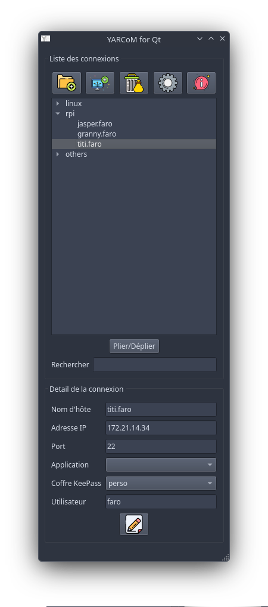
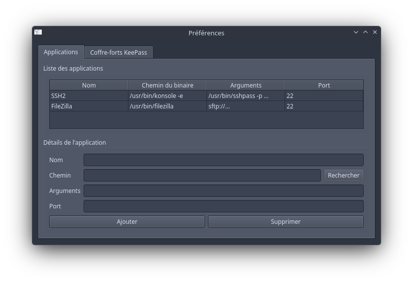
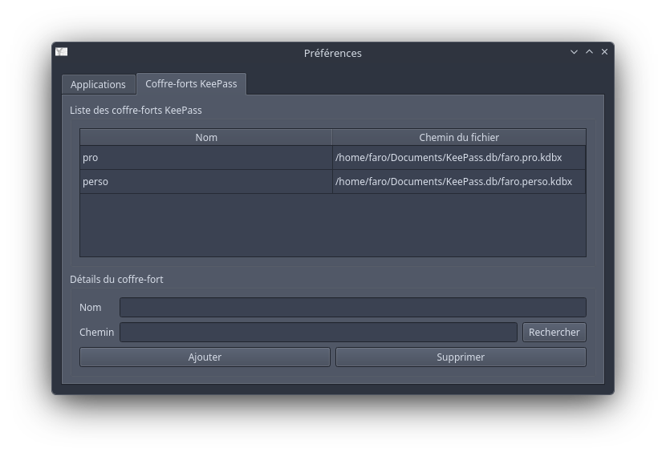
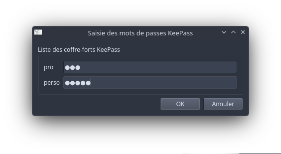

# YARCoM
<p align="center">
     
</p>
This tool manages a list of remote devices to connect to using your favorite connection tool (ssh on Linux, PuTTY on MS OS, etc.).

This tool is developped using Python and Qt pyside6 library. You can find the same tool using TCL/Tk, but less advanced, in another directory in my repository.  

A keepass vault can be associated to retrieve passwords automatically.

## Screenshots
### Window types
* Main
    <p align="left">
        
    </p>
* Preferences
    * Applications declaration
        <p align="left">
            
        </p>
    * Keepass vaults declaration
        <p align="left">
            
        </p>
* Vault password entry
    <p align="left">
        
    </p>

## Features
1. Only one configuration file (.json) describing the setup :
    * A global configuration including:
        * Connection tools (SSH, SFTP, etc.)
        * KeePass vaults
    * Connections are structured as following :
        * Its name
        * IP address
        * Connection port
        * Connection tool to use
        * KeePass vault to use
        * Username for retrieving its vault password
> When a Keepass database is provided, username can be one of the 'title' or 'username' Keepass element. If this references a 'username' element, be aware that the last found in the database will be retrieved.
2. All is done from the main window :
    * Create a sub-tree
    * Create a connections
    * Delete a sub-tree or a connection
    * Access to preferences window
    * Selecting an item allow its modification :
        * For a sub-tree, its name
        * For a connection, all its structure, described previously
3. Drag and drop in connections tree allow to reorder sub-trees and connections. All changes are saved automatically.
4. If one or many keepass are defined, each vault password is asked at startup (or when you configure a new one). Each password is encrypted in memory. None of them are saved in the configuration file (unlike mRemoteNG). The vaults are used in conjunction with the username defined for each connection.

## Installation

1. Clone this project :
```
$ git clone git@github.com:faro93/YARCoM.Qt
```
**N.B. :** _Be careful to configure your SSH token to be able to clone this repository._

2. Go to the directory and activate the virtual environment :
```
$ cd YARCoM.Qt/
$ python -m venv .venv
```
- For macOS and Linux : `source .venv/bin/activate`
- For Windows (cmd) : `.venv\Scripts\activate.bat`
- For Windows (PowerShell) : `.venv\Scripts\Activate.ps1`

3. Then install required python libraries :
```
$ pip install -r requirements.txt
```

### How to convert the tool to .exe file for Windows
Some folks asked me how to convert this tool as it could starts like any other applications on Windows. So, I provide here how I did it with `pyintaller.exe`.
> [!important]
This means that installation part above has already been done.


**So, let's start folk !**
As prerequisite, you should be logged in the previous virtual environment to do the following steps and in the same directory.
1. Install pyinstaller tool : `pip install pyinstaller`
2. Run pyinstaller with the following parameters : `pyinstaller.exe -i icons/YARCoM.256x256.ico -F YARCoM.py`
    - `-i` to set the application's icon, followed by its path
    - `-F` to generate a 'one file' application
3. When pyinstaller ends, you should find 2 interrested files :
    - `YARCoM.spec` : that contains the parameters used to build the 'one file' application
    - `YARCoM.exe` in `dist` directory : that is the final application to be used
> [!tip]
If you would like to build on an other computer, you can use `.spec` file like this : `pyinstaller YARCoM.spec`.
So, save `YARCoM.spec` file for futur building :grinning:

4. Move `YARCoM.exe` to the destination directory from where you would launch the application.
5. That's it ! :relaxed:


## Usage
Run **YARCoM.py** :
* For Windows :     
```
python.exe .\YARCoM.py
```
* For Linux and MacOS (I guess) :
```
./YARCoM.py
```
**N.B. :** _shebang script is configured with_ `#!/usr/bin/env python3`_, so it will run with your_ `venv` _installed python._

## Configuration
### Main window
* Create a new sub-tree 
* Create a new connection 
* Delete a sub-tree or a connection 
* Selecting an item allow its modification :
    * For a sub-tree, its name
    * For a connection, all its structure, described previously
    * Modification is saved by clicking 

### Preferences window 
#### Applications
* Give a name to the new application
* Enter its path and eventually the first argument
    ```shell
    /usr/bin/konsole -e
    ```
* Enter the arguments needed to connect to the equipement
    ```shell
    /usr/bin/sshpass -p <password> /usr/bin/ssh -o StrictHostKeyChecking=accept-new -l <user> -p <port> <ip>
    ```
    here, 2 commands are used :
    * ```sshpass -p <password>``` to give the password retrieved from the vault
    * ```/usr/bin/ssh -o StrictHostKeyChecking=accept-new -l <user> -p <port> <ip>```
        * ```-o StrictHostKeyChecking=accept-new``` to automatically accept new fingerprint from the new connection
        * ```-l <user>``` to give the username to ```ssh```
        * ```-p <port>``` to give the port to ```ssh```
        * ```<ip>``` to give the IP address to ```ssh```
    ##### Linux examples
    * OpenSSH : `/usr/bin/sshpass -p <password> /usr/bin/ssh -o StrictHostKeyChecking=accept-new -l <user> -p <port> <ip>`
    * FileZilla : `/usr/bin/filezilla sftp://<user>:<passwor>@<ip>`
    ##### Windows examples
    * PuTTY : `putty.exe -ssh -l <user> -pw <password> <ip>`
    * WinSCP : `WinSCP.exe /username=<user> /password=<password> <ip>`


#### Keepass vaults
* Give a name to the vault
* Enter its path

> [!NOTE]
> Configuration is saved when the window is closed.

## Contributing
Me &#x1f601;

Pull requests are welcome. For major changes, please open an issue first
to discuss what you would like to change.

## License
[GPL](https://www.gnu.org/licenses/gpl-3.0.html)
